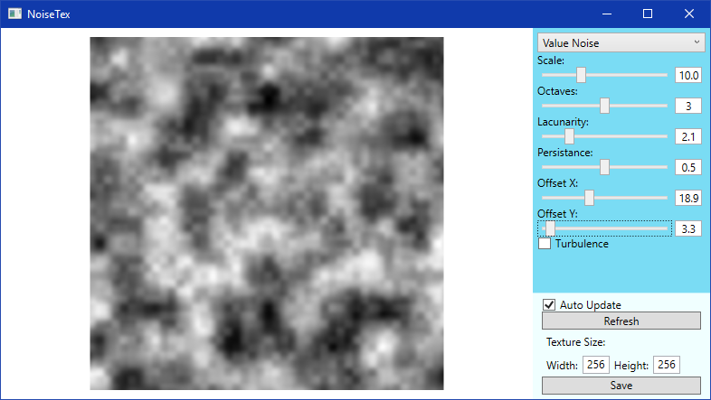
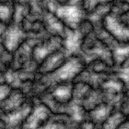

# NoiseTex
NoiseTex is a simple application for creating and saving noise textures with plenty of freedom when customizing parametres.

## Features
* Supported noise types: Perlin Noise, Value Noise
* Fractional Brownian Motion (fBm)
* Turbulence option for creating sharp valleys
* Saving texture as .png file

 

 

# Compiling and extending
## Requirements
* Visual Studio 2017
* .NET 4.6 or higher

Application doesn't use any external packages at this point.
